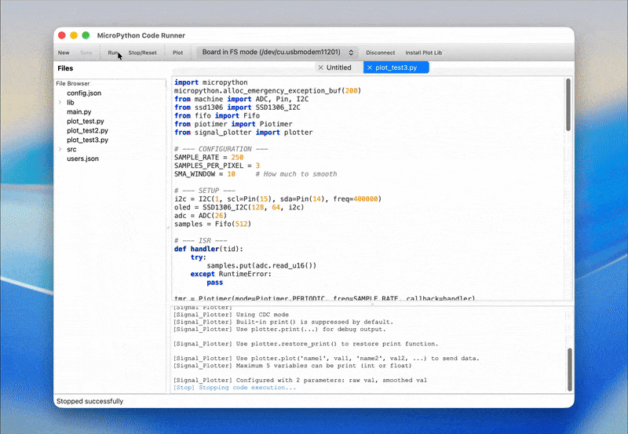

# MicroPython Plotter

This tool helps you visualize data from your MicroPython device effectively and in real-time.



## Why this tool?

### The Traditional Workflow
Usually, when working with sensors (like Heart Rate or PPG) on MicroPython, the workflow is slow and tedious:
1.  Log sensor data to a file on the device.
2.  Wait for the experiment to finish.
3.  Copy the file to your computer.
4.  Analyze and plot the data.

**Result:** You can't see what's happening *now*. Tuning filters or debugging signal issues becomes a slow cycle of "record -> check -> retry".

### The Solution: Real-time Preview
**MicroPython Plotter** changes this by providing a **Real-time Preview** of your data.
*   **Instant Visualization:** See your sensor data immediately as it happens.
*   **High Performance:** Capable of plotting 5 channels at ~700Hz.
*   **Quick Iteration:** Includes a basic code editor to let you tweak parameters, run the code, and see the results instantly.

> **Note:** The built-in code editor is designed for quick adjustments (the "Plot -> Tweak -> Run" loop), not to replace your full-featured IDE. It is currently a proof of concept with room for improvement.

It won't break your MicroPython device, **but always backup the important data on your MicroPython device when using this tool.**

## Key Features

### Interactive Plotting
*   **Zoom & Pan:** Inspect signal details closely by zooming in and out.
*   **Customization:** Change line colors to easily distinguish between different data channels.
*   **Pause/Resume:** Freeze the display to analyze a specific moment.
*   **Automatic Legends:** Variable names transmitted from your code (e.g., `plotter.plot('temperature', t)`) automatically appear in the plot legend, making it easy to identify signals.

### Future Roadmap
*   **History View:** Review past data sessions.
*   **Data Saving:** Improved export options for further analysis.
*   **Better Editor:** Add more features to the built-in code editor.
*   **Multiple Call:** Able to be called at different places and shown in different graph.
*   **Timestamp Function:** Add an option to transmit data with timestamp, which can be shown on the x-axis

## Usage

### 1. Install the Library on Your Device

1. Connect your device to the computer
2. On the toolbar, click the button called `Install Plot Lib` (on the right)

> To install it manually with another tool instead: copy the content of [`src/resources/plotter_lib.py`](src/resources/plotter_lib.py) (the `SIGNAL_PLOTTER_SOURCE` string) into a `signal_plotter.py` file, then upload it to the **`lib`** folder on your device.

> **On macOS**: if the app won't open due to a security warning, run `xattr -d com.apple.quarantine <path-to-micropython-plotter>` in the terminal, e.g. `micropython-plotter_macos_arm64.app`.

### 2. Write Your Micropython Code

1. Import the library in the file you want to use

   ```python
    from signal_plotter import plotter
   ```

2. Call `plotter.plot('name', value, ...)` with named variables

   **Rules:**
   - Use the format: `plotter.plot('name1', value1, 'name2', value2, ...)`
   - Maximum 5 pairs of names and variables allowed (10 arguments total)
   - Variable names must be strings, 16 characters or less
   - Values must be int or float (`float` values are automatically converted to `int` before sending)
   - Values are sent as unsigned 16-bit integers (`0`–`65535`). Negative numbers wrap around (e.g. `-1` becomes `65535`), and out-of-range values get truncated — scale or offset your data beforehand if needed
   - `plotter.plot()` can be called at only one place in your code (can be inside a loop, but one place)

   **Correct example:**

   ```python
    import time
    from signal_plotter import plotter
    
    for i in range(10000):
       plotter.plot('x', i, 'y', 2*i, 'z', 3*i)
       time.sleep(0.05)
   ```

   **Incorrect examples:**

   **❌ Missing names:**
   ```python
    from signal_plotter import plotter
    
    # ERROR: Arguments must be name-value pairs
    plotter.plot(100, 200, 300)
   ```
   
   **❌ Multiple plot locations:**
   ```python
    from signal_plotter import plotter
    
    for i in range(10000):
       plotter.plot('x', i)  # 1st call site
       for j in range(100):
           plotter.plot('x', j)  # 2nd call site - WRONG: values from both loops get mixed together unpredictably
           time.sleep(0.05)
   ```

### 3. Why doesn't `print()` work anymore?

To make the plotting fast and smooth, this library **disables the standard Python `print()` function** by default — nothing will happen when you call `print()`.

**If you want to enable the original print():** You can turn it back on by running `plotter.restore_print()` anytime after importing the library.

For example:
```python
    from signal_plotter import plotter
    plotter.restore_print() # enable the print function
    
    for i in range(10000):
       print('debug:', i)
       plotter.plot('x', i, 'y', 2*i)
       time.sleep(0.05)
```
Another way is to use `plotter.print("message")` instead, when you need to print something.

## Advanced (Optional)

These aren't needed for typical use, but are available if you need them.

### Switch to UART mode
By default, data is sent over USB (CDC). If your setup needs physical UART pins instead:
```python
plotter.set_uart_mode(tx=4, rx=5, baudrate=115200)
```
Call `plotter.set_cdc_mode()` to switch back.

### Debug LED
Toggle a pin periodically to visually confirm your loop is running at the expected rate:
```python
plotter.enable_debug(led_pin=25, toggle_interval=250)  # toggles every 250 plotter.plot() calls
```
Call `plotter.disable_debug()` to turn it off.

### Re-suppress `print()`
If you called `plotter.restore_print()` and want to silence the built-in `print()` again:
```python
plotter.suppress_print()
```
